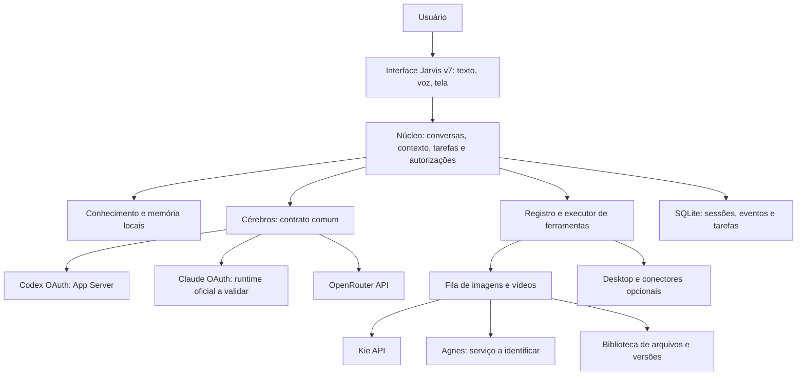

# Jarvis v7 — plano mestre

Data: 13/09/2026. Status: especificação proposta para construção. Nome confirmado pelo usuário: **Jarvis v7**. Este documento substitui o plano inicial baseado apenas no pacote Astra. Não há aplicação implementada nesta pasta.

## Objetivo

Construir um assistente pessoal instalável que converse, consulte conhecimento, guarde memórias, execute tarefas, veja contexto autorizado e produza imagens e vídeos. Entregar também um repositório de referência que ensine outra pessoa a instalar, configurar, personalizar e criar módulos sem depender do nosso computador ou das nossas contas.

O Jarvis v7 terá seus próprios dados, ferramentas e regras. O cérebro será substituível. Cada pessoa conectará os próprios serviços.

## Decisões confirmadas e propostas

| Tema | Decisão | Situação |
|---|---|---|
| Nome | Jarvis v7 | Confirmado |
| Uso e distribuição | Sistema nosso + referência reutilizável para outras pessoas | Confirmado |
| Cérebro principal | Codex com OAuth da própria conta | Confirmado como opção; fluxo oficial documentado |
| Cérebro alternativo | Claude com OAuth da própria conta | Confirmado como intenção; validação de distribuição descrita em documento próprio |
| API de modelos | OpenRouter | Confirmado; exceção explícita à preferência anterior por OAuth sempre |
| Imagens e vídeos | Kie + “Agnes” | Confirmado como intenção; identidade do segundo serviço pendente |
| Idioma inicial | Português, com estrutura para tradução | Proposta |
| Instalação inicial | Local, um usuário por instância | Proposta para reduzir dependências e facilitar a reprodução |
| Stack | TypeScript, interface React, servidor Fastify, SQLite e arquivos locais | Proposta, não requisito herdado do PDF |
| Licença do código próprio | MIT como candidata | Decisão de publicação ainda aberta |

Não haverá chave OpenAI ou Anthropic obrigatória no onboarding padrão. OpenRouter e mídia terão credenciais independentes conforme seus contratos; OAuth de um cérebro não autentica outro serviço.

## Experiência de quem instalar

1. Instala os pré-requisitos indicados e executa a verificação do ambiente.
2. Abre o Jarvis v7 com dados de exemplo claramente identificados, sem conta obrigatória para explorar notas e interface.
3. Escolhe Codex, Claude ou OpenRouter e conecta a própria conta pelo caminho correspondente.
4. Seleciona uma pasta de conhecimento e vê quantidade de documentos, falhas de leitura e progresso da indexação.
5. Faz uma pergunta, recebe resposta e confere as fontes.
6. Salva uma memória, altera uma preferência e aprende a corrigir ou remover o que guardou.
7. Conecta mídia, escolhe um modelo disponível, gera um arquivo e o encontra na biblioteca.
8. Ativa voz, tela e ferramentas conforme precisar, com disponibilidade explícita por ambiente.

Sem um cérebro conectado, o produto oferece exploração e busca local; não simula respostas de IA como se fossem reais.

O [guia de configuração e atualizações](configuracao-e-atualizacoes.md) detalha o assistente de instalação, presets, seleção por conversa/tarefa, atualização pela interface, preservação dos dados e rollback.

## Módulos do produto

| Módulo | Responsabilidade | Resultado visível |
|---|---|---|
| Conversa | Texto, histórico, seleção de cérebro, cancelamento e fontes | Respostas e ações na mesma linha do tempo |
| Conhecimento | Importar, extrair, indexar, buscar, atualizar e relacionar documentos | Biblioteca + grafo opcional |
| Memória | Fatos e preferências explicitamente salvos, com origem e revisão | Memórias editáveis e exportáveis |
| Tarefas | Executar etapas, aguardar eventos, retomar e registrar resultado | Lista de trabalhos com estados reais |
| Ferramentas | Registro de capacidades, permissões, execução e resultados | Conectores disponíveis e ações comprovadas |
| Estúdio de mídia | Criar/editar imagens e gerar vídeos conforme o modelo | Galeria, versões, download e vínculo com a conversa |
| Voz | Transcrição, fala, pausa, interrupção e ativação opcional por nome | Conversa por voz com alternativa textual |
| Tela | Captura sob demanda, análise e indicação de onde agir | Resposta visual ou orientação ancorada na captura |
| Desktop | Mouse, teclado, observação de aplicativo e overlay quando suportados | Execução controlável com botão de parada |
| Foco | Timer, alvo, pausa, tolerâncias e resumo agregado | Sessões que sobrevivem à recarga da interface |
| Conexões | Contas, saúde dos adaptadores e modelo disponível | Estado de conexão e recuperação de falhas |
| Diagnóstico | Versões, saúde, falhas, latência e uso informado pelos provedores | Comando doctor e relatório exportável sem segredos |

## Fluxos que definem o sistema completo

**Conhecimento:** “O que decidimos sobre este projeto?” → busca → trechos → resposta com fonte. “Lembre que...” → arquivo/registro persistido → índice atualizado → consulta seguinte encontra a memória.

**Criação:** “Crie três propostas de capa para esta aula” → consulta briefing e referências escolhidas → monta pedidos de mídia → exibe modelo e consumo estimado quando disponível → executa dentro do orçamento autorizado → baixa os arquivos → permite escolher uma versão. “Anime esta imagem” cria um trabalho de vídeo ligado à imagem aprovada, se o modelo suportar essa entrada.

**Trabalho operacional:** “Prepare um documento a partir deste modelo” → preenche com evidências → marca dados ausentes → gera rascunho → salva → devolve arquivo real. O envio a outra pessoa é uma etapa identificada e usa a autorização aplicável.

**Tela:** “Explique este erro” usa a captura atual. “Mostre onde clicar” produz orientação. “Execute esta tarefa” inicia um fluxo separado de controle, com escopo, estados e parada imediata.

**Rotina:** sessão de foco com pausa e resumo; depois briefings de agenda e tarefas, ativados pelo usuário. Telegram, Google, Notion, Slack e telefonia são módulos posteriores, não dependências para começar.

## Arquitetura em uma visão

A especificação técnica está em [arquitetura e contratos](arquitetura-e-contratos.md). O plano preserva as diferenças entre um runtime de agente, como Codex, e uma chamada de modelo pelo OpenRouter: não tentaremos tratá-los como protocolos idênticos.

## O que significa “completo”

Completo será uma entrega com instalação reproduzível, núcleo funcional, cérebros suportados com estado verificado, mídia funcional com arquivos reais, diagnóstico, testes, documentação e exemplos de extensão. Cada recurso deverá mostrar se está disponível, desconectado, não suportado ou experimental.

“Referência para qualquer pessoa” significa que outra pessoa pode reproduzir a instalação e aprender com os módulos. Não significa que qualquer sistema operacional, assinatura ou modelo terá automaticamente todas as capacidades. A matriz de compatibilidade deve registrar o que foi testado.

O **MVP funcional** terá conversa, fontes, memória e pelo menos um cérebro real. A **beta criativa** acrescentará fila, Kie e biblioteca; o segundo provedor de mídia entra após identificação. A **referência completa** acrescentará os demais cérebros validados, voz, visão, foco, ferramentas, guias e teste de instalação limpa. Não chamar o MVP de sistema completo.

## Próximo passo de implementação

Começar pelo marco M0 do [roadmap](roadmap-e-criterios.md): comprovar os adaptadores e seus limites, depois criar o núcleo. Isso resolve cedo as dependências centrais pedidas pelo usuário, inclusive OAuth e mídia, antes de investir em acabamento visual ou dezenas de integrações.

A identidade de “Agnes” é a única informação de fornecedor ainda solicitada ao usuário. O restante do planejamento não depende dessa resposta.
